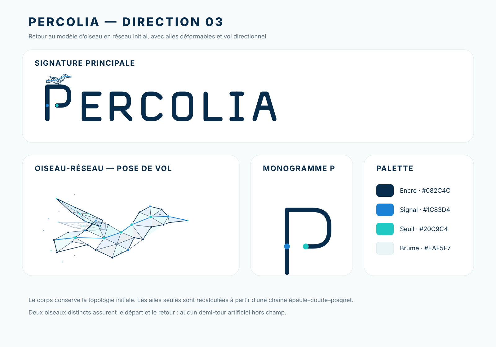

# Identité visuelle Percolia — direction 02

<p align="center">
  
</p>

## Principe

**La structure fiable qui émerge du bruit.**

La direction 02 conserve le `P` à seuil interrompu, transforme `ERCOLIA` en petites capitales et remplace le premier oiseau polygonal par un **martinet-réseau articulé**.

Le petit oiseau est perché sur le `P` dans la signature statique. Sur le web, il déploie réellement ses ailes, décolle, suit une trajectoire courbe, effectue un scan LiDAR et revient se poser.

## Arborescence

```text
Logo/
├── README.md
├── CHARTE_GRAPHIQUE.md
├── tokens.css
├── tokens.json
├── build_lockups.py
├── brand-board.svg
├── percolia-lockup-horizontal*.svg
├── percolia-lockup-stacked.svg
├── Police/
│   ├── README.md
│   ├── build_wordmark.py
│   ├── source/geometry.json
│   └── *.svg
└── Oiseau/
    ├── README.md
    ├── build_bird.py
    ├── build_demo.py
    ├── bird-animation.css
    ├── bird-animation.js
    ├── demo.html
    ├── source/bird_model.json
    └── *.svg
```

## Régénération

```bash
python Logo/Police/build_wordmark.py
python Logo/Oiseau/build_bird.py
python Logo/build_lockups.py
python Logo/Oiseau/build_demo.py
```

Les SVG et la page autonome sont reproductibles à partir des sources JSON et des générateurs Python.

## Actifs principaux

- `percolia-lockup-horizontal.svg` : signature par défaut ;
- `Police/percolia-p-monogram-primary.svg` : favicon et icône ;
- `Oiseau/percolia-bird-compact.svg` : oiseau perché statique ;
- `Oiseau/percolia-bird-primary.svg` : rig complet ;
- `Oiseau/demo.html` : démonstration autonome du vol.

## Statut

Direction créative éditable. Une recherche d’antériorités et des tests de reconnaissance à petite taille restent nécessaires avant dépôt définitif.
