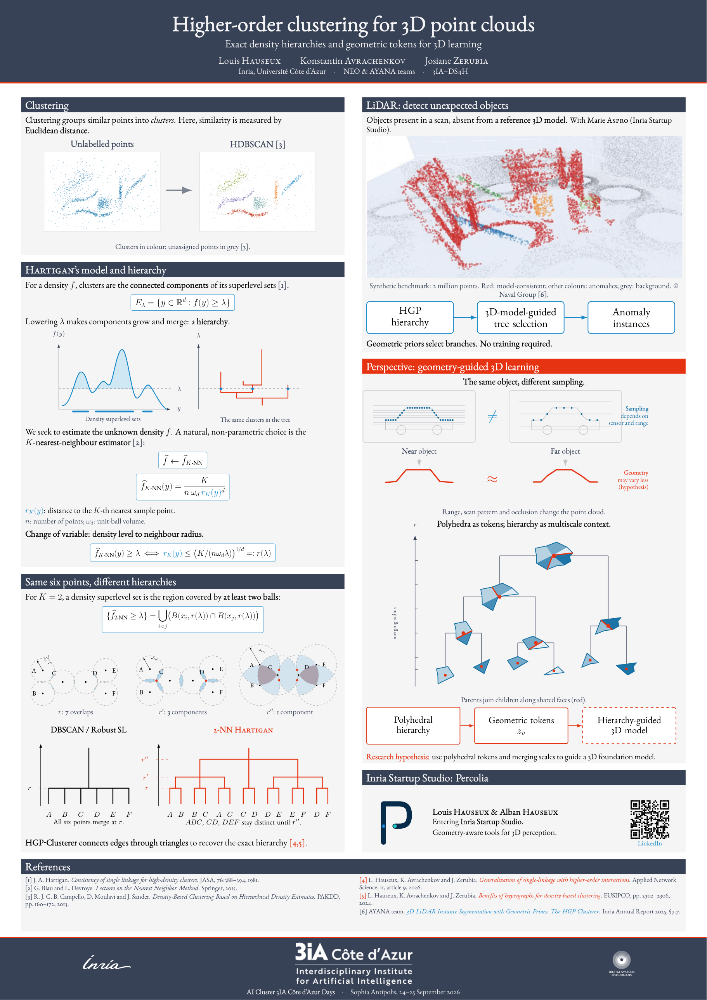

# Poster scientifique — Journées 3IA 2026

[**PDF A0 portrait**](Poster_3IA_2026_Hauseux_A0.pdf) · [Source LaTeX](poster.tex)

[](Poster_3IA_2026_Hauseux_A0.pdf)

**Higher-order clustering for 3D point clouds**  
Louis Hauseux · Konstantin Avrachenkov · Josiane Zerubia  
AI Cluster 3IA Côte d’Azur Days, Sophia Antipolis, 24–25 septembre 2026.

## Impression et composition

Une page **841 × 1189 mm**, A0 portrait. Imprimer à **100 % / taille réelle**.
Gabarit Inria / 3IA / DS4H, palette Inria, EB Garamond : 3IA principal au centre, Inria à gauche, DS4H à droite. Les logos institutionnels sont repris sans redessin du gabarit et restent matriciels. Les schémas scientifiques et les 2 309 points de l’exemple 2D sont en TikZ ; Percolia est vectoriel.

Lecture : colonne gauche (1–3), puis colonne droite (4–6). La section rouge indique une perspective de recherche, pas un résultat validé.

## Contenu et attribution

L’exemple 2D est celui du tutoriel HDBSCAN utilisé dans la soutenance. Le clustering est recalculé avant le cadrage visuel, avec `min_cluster_size=15` et `min_samples=16` dans scikit-learn, qui inclut le point lui-même. Il ne s’agit pas d’une comparaison de performances HGP / HDBSCAN. Les effectifs sont dans `assets/clustering_metadata.json` ; licence amont dans `assets/HDBSCAN-LICENSE`.

Le modèle présente les composantes connexes des sur-niveaux de Hartigan et leur estimation K-NN. Pour l’identité de recouvrement, le rang K est pris dans tout l’échantillon et les boules sont fermées. La convention leave-one-out pour évaluer la densité aux seuls points de l’échantillon est distincte. Les schémas de densité et de hiérarchie sont illustratifs ; les seuils du triangle équilatéral sont analytiques.

La figure avec Marie Aspro est un **benchmark synthétique de 2 000 000 de points**, crédité **© Naval Group**, déjà publié dans la soutenance. Aucune donnée industrielle confidentielle n’est ajoutée. La hiérarchie guidant un modèle de fondation est explicitement présentée comme une hypothèse à évaluer. Le dessin planaire illustre le recollement de composants, pas un résultat de segmentation 3D entraînée.

Percolia est présenté comme le projet de **Louis et Alban Hauseux**, entrant dans Inria Startup Studio. Le QR renvoie au dépôt public du projet. Aucun contenu d’échange de mails n’est publié.

### Sources principales

- [Soutenance, sources figées au commit 3593fbf](https://github.com/Ludwig-H/Manuscrit-de-th-se/tree/3593fbf25434c4715b37537eae1287bf49239fa7/Soutenance/soutenance) : figures de Hartigan, `hierarchie_surfaces.tex` et `imgs/Resultat_MarieBenchmark.png`.
- [Gabarit Inria / EUVIP, commit 46b40ea](https://github.com/Ludwig-H/Generalized-Frangi-for-Automatic-Crack-Extraction-on-FIND-dataset/tree/46b40eab4992515b6fde10bb2cd6924b63ab9db6/EUVIP/poster), adapté de [Gemini](https://github.com/anishathalye/gemini), licence conservée dans `GEMINI-LICENSE.md`.
- [Données HDBSCAN](https://github.com/scikit-learn-contrib/hdbscan/blob/master/notebooks/clusterable_data.npy), Leland McInnes, John Healy et contributeurs. Empreinte SHA-256 dans `assets/sources.json`.
- [Applied Network Science 2026](https://doi.org/10.1007/s41109-025-00756-1), [EUSIPCO 2024](https://doi.org/10.23919/EUSIPCO63174.2024.10715271), [rapport AYANA 2025, §7.7](https://radar.inria.fr/report/2025/ayana/index.html).
- [Journées scientifiques 3IA 2026](https://3ia.univ-cotedazur.eu/ai-cluster-3ia-cote-dazur-days-2026).

Les publications des auteurs sont signalées en rouge. La bibliographie du poster se modifie dans `references.tex`. Les logos et images conservent les droits de leurs titulaires.

## Compiler

Tous les fichiers nécessaires à LaTeX sont conservés dans ce dossier. La compilation ordinaire est hors ligne, sans Python ni accès aux autres dépôts :

```bash
cd 'Présentations/Posters/3IA_Days_2026'
make
```

Dépendances Debian / Ubuntu : `texlive-xetex texlive-latex-extra texlive-fonts-recommended fonts-ebgaramond`. Sur Overleaf, choisir `poster.tex` et **XeLaTeX**. Aucun fichier de police n’est redistribué. Le thème charge explicitement les contours OTF ou TTF et applique une graisse synthétique au dessin complet afin de préserver accents et petites capitales.

`make` compile deux fois dans `build/`, ignoré par Git, puis actualise le PDF. Pour reconstruire les données ou l’aperçu :

```bash
python3 -m pip install -r requirements-build.txt
make assets figures
make check preview
```

`prepare_assets.py` restaure uniquement les fichiers absents et vérifie les empreintes des images et données. `check_poster.py` contrôle la page A0, les textes attendus, l’incorporation des polices et les liens ; l’inspection visuelle reste nécessaire pour la mise en page. Le workflow `.github/workflows/poster-3ia.yml` reconstruit les livrables et les enregistre sur `main`, sans créer de branche.
