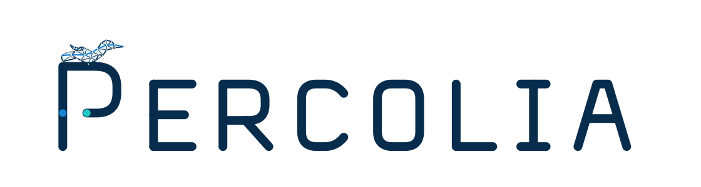

# Percolia

Percolia développe une technologie de **structuration automatique de données complexes et bruitées**, d’abord appliquée aux nuages de points LiDAR 3D.

Le produit initial, issu des travaux de recherche de Louis Hauseux et développé avec Alban Hauseux, vise un clustering de haute précision, robuste au bruit de mesure, sans dépendre d’un réentraînement pour chaque capteur. La marque doit donc exprimer à la fois :

- la rigueur scientifique et géométrique ;
- le passage du bruit à une structure exploitable ;
- la confiance nécessaire à un logiciel industriel ;
- une technologie générique, au-delà du seul LiDAR.

## Identité visuelle

La première direction de marque éditable est dans [`Logo/`](Logo/README.md).

  

Cette proposition comprend un mot-symbole vectoriel sur mesure, un monogramme `P`, un oiseau-réseau animé, les variantes monochromes/inversées et les sources de génération.
